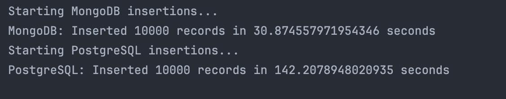
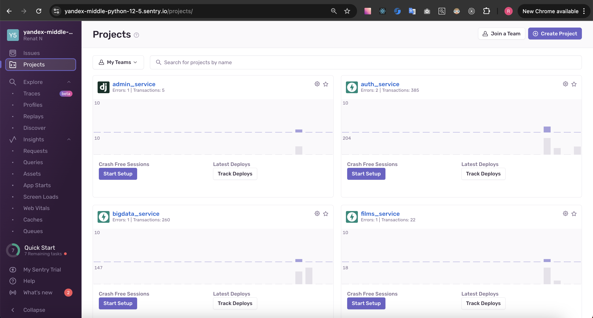
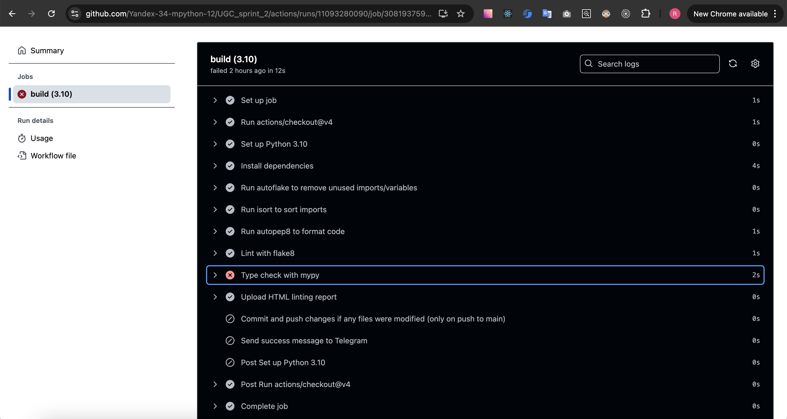

# Проектная работа 9 спринта

**Ссылка на проект**: [UGC Sprint 2](https://github.com/Yandex-34-mpython-12/UGC_sprint_2)

## Реализовано

- **ELK**: Развернуто ELK(Elasticsearch, Logstash и Kibana) и подключен к сервисам `auth_service, films_service, bigdata_service` посредством filebeat;
- **Исследование хранилища**: mongodb vs postgres;
- **API с MongoDB**: API реализующее CRUD для работы с закладками, лайками и рецензиями, использующий mongodb в качестве хранилища;
- **Sentry** подключен к сервисам `auth_service, films_service, bigdata_service, admin_service`;
- **CI/CD** Добавлены линтеры, проверки типов и репорт в Telegram

## Общая информация

Проект состоит из микросервисов для:
- **Аутентификации** (`auth_service`)
- **Управления фильмами** (`films_service`)
- **Обработки больших данных** (`bigdata_service`)
- **ETL-процессов**:
  - ETL для передачи данных из базы фильмов в `Elasticsearch`.
  - UGC ETL для передачи данных из Kafka в `ClickHouse`.
- **Администрирования** (`admin_service`), построенного на Django для управления пользователями и фильмами.

### ELK
- в логах корректно передается X-Request-Id
- можно просмотреть логи `auth_service, films_service, bigdata_service`
- в логах нет приватной информации


### Mongodb vs postgres
Анализ проведен при помощи `perofrmance_tests/pg_vs_mongo.py`. Записывается одна запись 
в количестве 1000 штук.
Запуск осуществляется при помощи `docker compose up`
Результаты также могут разнится от разных систем и CPU.

К примеру, результат на 1,4 GHz Quad-Core Intel Core i5, 16 GB 2133 MHz LPDDR3:

```
python performance_tests/pg_vs_mongo.py
PostgreSQL: Created table test_table
Starting MongoDB insertions...
MongoDB: Inserted 1000 records in 2.0577480792999268 seconds
Starting PostgreSQL insertions...
PostgreSQL: Inserted 1000 records in 55.463014125823975 seconds
```

Результат на M1, 8GB Ram:



### Sentry


### CI/CD


### Kafka
Кластер Kafka состоит из трёх нод и UI для управления:

1. **Kafka-0**  
   - Порты: 9092 (внутренний), 9094 (внешний)
   - Данные хранятся в томе `kafka-0_data`
   - Автоматическая проверка состояния

2. **Kafka-1**  
   - Порты: 9092, 9095
   - Данные сохраняются в `kafka-1_data`
   - Поддержка отказоустойчивости

3. **Kafka-2**  
   - Порты: 9092, 9096
   - Данные хранятся в томе `kafka-2_data`

4. **Kafka-UI**  
   Предоставляет веб-интерфейс для управления топиками, брокерами и сообщениям.

### ClickHouse
- Колонночная база данных для аналитики
- Данные хранятся в томе `clickhouse_data`
- Доступ через порт 8123

### BigData сервис

Этот сервис реализован на FastAPI и использует Bearer JWT токены для авторизации запросов. Для тестирования сервиса можно использовать:

1. Запустить команду `docker compose up`.
2. Открыть браузер и перейти на `http://localhost:8002/api/openapi#/` для тестирования функционала записи данных в Kafka.

### Сервис аутентификации AUTH

Мы используем [FastAPI Users](https://fastapi-users.github.io/fastapi-users/latest/) для управления пользователями, включая их создание и удаление. Аутентификация осуществляется через стратегию Redis JWT, которая хранит JWT-токены в кэше Redis для безопасного и эффективного управления сессиями.

Механизм работы аутентификации через JWT:

1. Клиент отправляет данные (email и пароль) в `auth_service` и получает access токен.
2. С каждым запросом к сервисам клиент передаёт заголовок `Authorization: Bearer <токен>`.
3. Бэкенд проверяет и расшифровывает токен, чтобы получить информацию о пользователе (user_id).

Реализована система проверки ролей (RBAC) для разделения доступа (Admin, User).

### Сервис Фильмов Films

TBA

## Настройка переменных окружения

Все микросервисы управляются центральным `.env` файлом, который должен быть настроен перед запуском.

### Шаги для настройки `.env` файлов

1. **Перейти в корневую директорию**

2. **Создать `.env` файл**:  
   Скопировать файл `.env.example`, чтобы создать новый `.env`. Используйте команду:

   ```bash
   cp .env.example .env
   ```


3. **Редактирование файла .env:**:
   Откройте файл .env и настройте переменные в соответствии с вашей локальной средой разработки или продакшеном.

   ```env
   # Example of environment variables in .env file
   APP_CONFIG__RUN__DEBUG=false
   APP_CONFIG__RUN__HOST=localhost
   APP_CONFIG__RUN__PORT=8000
   ```

4. **Cоздать файл .es_state::
   Перейти в `etl/`и выполните команду:

   ```bash
   cp es_state.json.example es_state.json
   ```
### Важные Примечания

- Убедитесь, что все необходимые переменные окружения указаны в `.env` файлах, чтобы избежать ошибок во время выполнения.
- Если какая-либо переменная отсутствует или неправильно настроена, сервисы могут не запуститься или работать некорректно.
- Храните ваши `.env` файлы в безопасности и никогда не добавляйте их в систему контроля версий. Передавайте их команде безопасным способом по мере необходимости.

## Запуск Сервисов

После настройки файлов `.env` и `.es_state` вы можете запустить каждый сервис с помощью соответствующей команды, чаще всего через Docker. Например:
`
docker compose up --file=docker-compose.yml
`

## Для разработки

Для разработки доступен файл docker-compose.override.yml, который предоставляет доступ к контейнерам через порты. При запуске командой `docker compose up` будет создана веб-среда с полным доступом ко всем сервисам через порты и интерфейс Swagger (см. ниже).

## Доступ к Документации API

После настройки и запуска сервисов, документация API будет доступна по следующим ссылкам:

http://localhost:8001/api/openapi#/ — Сервис фильмов (FastAPI)
http://localhost:8002/api/openapi#/ — Сервис BigData (FastAPI)
http://localhost:8003/api/openapi#/ — Сервис авторизации (FastAPI)
http://localhost:8004/api/openapi#/ — Сервис администрирования пользователей и фильмов (Django)

Эти ссылки предоставляют доступ к документации OpenAPI, где можно изучить доступные эндпоинты, параметры запросов и ответы.
